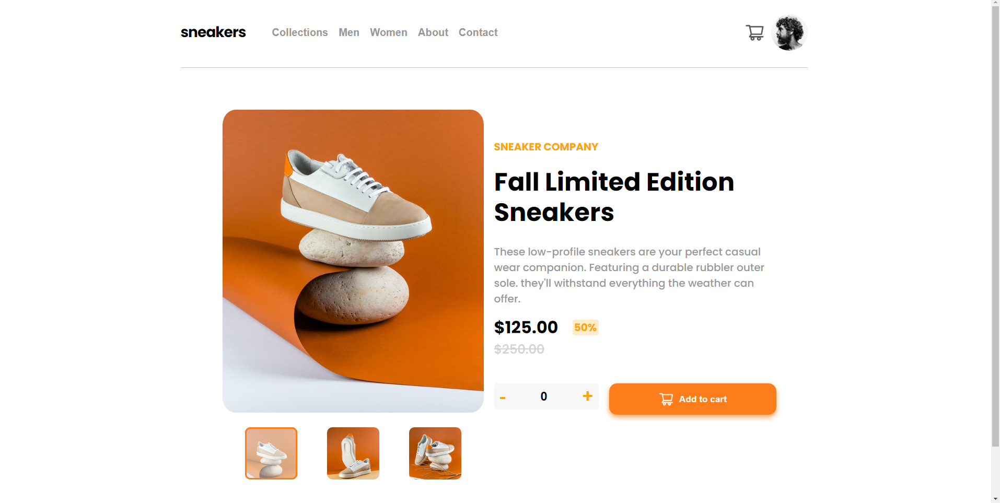
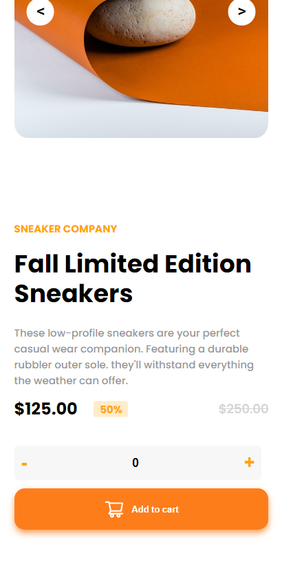

# Simple e-commerce product page

## 📝 Sobre o Projeto
O site consiste em uma página de produto em um e-commerce fictício.

## ⚛️ Tecnologias Utilizadas
* React JS
* Styled-components

## 💽 Como Iniciar o Projeto
para baixar as dependências utilize `npm install`  
utilize o comando `npm start` para inicializar.

## 💻 Preview do Projeto

### Desktop

### Mobile

